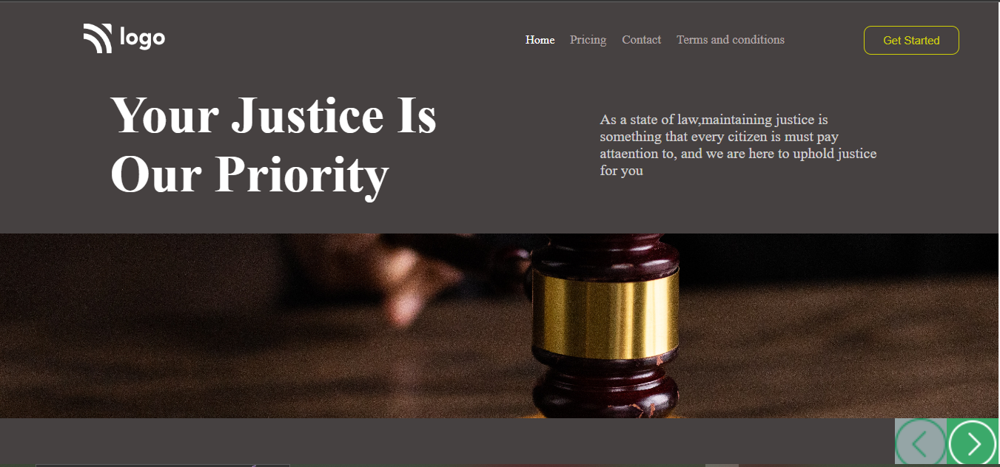

# Project 03: Law Home Page using HTML  and CSS 

Chandrakala P

## Final Look of the Webpage:

### Live project Link:

[project link](https://law-home-page-project3.netlify.app/)

## What I learnt from this Project?

- This project helped me to understand the whole idea of Html and css
- I learnt most of the basics tags in html and many properties in css.
- This project helped me to understand background-img and bgc buttons etc.

## Stacks and Tools:

- HTML and CSS
- HTML : list, p, heading tags, button, img, and many more
- CSS: margin, padding, bgc, color, text-decorations align items, display, flex, text align etc.

## It took around 2 hrs.
